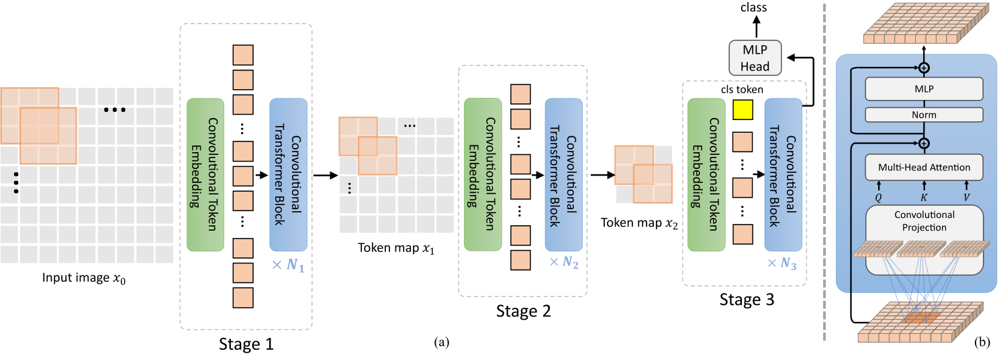
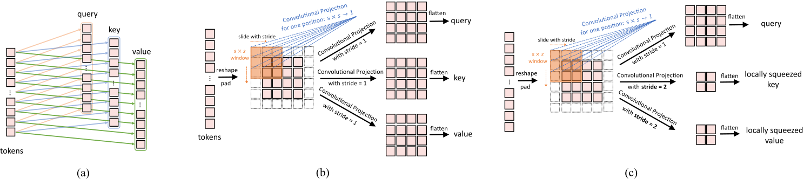

# 论文名称

## 目录

- [1. 简介]()
- [2. 数据集和复现精度]()
- [3. 准备数据与环境]()
    - [3.1 准备环境]()
    - [3.2 准备数据]()
    - [3.3 准备模型]()
- [4. 开始使用]()
    - [4.1 模型训练]()
    - [4.2 模型评估]()
    - [4.3 模型预测]()
    - [4.4 模型导出]()
- [5. 模型推理部署]()
    - [5.1 基于Inference的推理]()
    - [5.2 基于Serving的服务化部署]()
- [6. 自动化测试脚本]()
- [7. LICENSE]()
- [8. 参考链接与文献]()


## 1. 简介

这是CvT的PaddlePaddle实现

<div align="center">
    
</div>

<div align="center">
    
</div>

**论文:** [CvT: Introducing Convolutions to Vision Transformers](https://arxiv.org/pdf/2103.15808)

**参考repo:** [CvT](https://github.com/microsoft/CvT)

**aistudio体验教程:** [基于PaddleClas的CvT复现](https://aistudio.baidu.com/aistudio/clusterprojectdetail/3986279)

在此非常感谢Microsoft Open Source、lmk123568等人贡献的[CvT](https://github.com/microsoft/CvT)，提高了本repo复现论文的效率。


## 2. 数据集和复现精度

数据集为ImageNet，训练集包含1281167张图像，验证集包含50000张图像。

```
│imagenet/
├──train/
│  ├── n01440764
│  │   ├── n01440764_10026.JPEG
│  │   ├── n01440764_10027.JPEG
│  │   ├── ......
│  ├── ......
├──val/
│  ├── n01440764
│  │   ├── ILSVRC2012_val_00000293.JPEG
│  │   ├── ILSVRC2012_val_00002138.JPEG
│  │   ├── ......
│  ├── ......
```

您可以从[ImageNet 官网](https://image-net.org/)申请下载数据。

| 模型      | top1 acc (参考精度) | top1 acc (复现精度) | top5 acc (复现精度) | 权重 \| 训练日志 |
|:---------:|:------:|:----------:|:----------:|:----------:|
| CvT_13_224 | 0.816 | 0.79792 | 0.94720 | [CvT_13_224]() \| [train.log]() |

权重及训练日志下载地址：[百度网盘](url)


## 3. 准备数据与环境

### 3.1 准备环境

首先介绍下支持的硬件和框架版本等环境的要求，格式如下：

- 硬件：Nvidia V100 * 4
- 框架：
  - PaddlePaddle >= 2.2.0

* 安装paddlepaddle

```bash
# 安装GPU版本的Paddle
pip install paddlepaddle-gpu==2.2.0
# 安装CPU版本的Paddle
pip install paddlepaddle==2.2.0
```

更多安装方法可以参考：[Paddle安装指南](https://www.paddlepaddle.org.cn/)

* 下载代码

```bash
git clone https://github.com/huaibovip/paddle-CvT.git
cd paddle-CvT
```

* 安装requirements

```bash
pip install -r requirements.txt
```


### 3.2 准备数据

如果您已经ImageNet1k数据集，那么该步骤可以跳过，如果您没有，则可以从[ImageNet官网](https://image-net.org/download.php)申请下载。


### 3.3 准备模型

可以在此提示用户怎么下载预训练模型、inference模型（如果有）


## 4. 开始使用

### 4.1 模型训练

```shell
export CUDA_VISIBLE_DEVICES=0,1,2,3

python3.7 -m paddle.distributed.launch --gpus="0,1,2,3" \
    tools/train.py \
    -c ./ppcls/configs/ImageNet/CvT/CvT_13_224.yaml \
    -o Optimizer.lr.learning_rate=0.00025 \
    -o DataLoader.Train.sampler.batch_size=256 \
    -o DataLoader.Eval.sampler.batch_size=256 
```

部分训练日志如下所示,

```
[2022/05/15 16:56:46] ppcls INFO: [Train][Epoch 198/300][Iter: 1610/1669]lr: 0.00007, STCELoss: 2.51146, loss: 2.51146, batch_cost: 0.84725s, reader_cost: 0.00073, ips: 226.61433 images/sec
[2022/05/15 16:56:55] ppcls INFO: [Train][Epoch 198/300][Iter: 1620/1669]lr: 0.00007, STCELoss: 2.51265, loss: 2.51265, batch_cost: 0.84725s, reader_cost: 0.00073, ips: 226.61475 images/sec
[2022/05/15 16:57:03] ppcls INFO: [Train][Epoch 198/300][Iter: 1630/1669]lr: 0.00007, STCELoss: 2.51313, loss: 2.51313, batch_cost: 0.84725s, reader_cost: 0.00073, ips: 226.61570 images/sec
[2022/05/15 16:57:12] ppcls INFO: [Train][Epoch 198/300][Iter: 1640/1669]lr: 0.00007, STCELoss: 2.51318, loss: 2.51318, batch_cost: 0.84726s, reader_cost: 0.00073, ips: 226.61173 images/sec
[2022/05/15 16:57:20] ppcls INFO: [Train][Epoch 198/300][Iter: 1650/1669]lr: 0.00007, STCELoss: 2.51088, loss: 2.51088, batch_cost: 0.84724s, reader_cost: 0.00073, ips: 226.61790 images/sec
[2022/05/15 16:57:29] ppcls INFO: [Train][Epoch 198/300][Iter: 1660/1669]lr: 0.00007, STCELoss: 2.51170, loss: 2.51170, batch_cost: 0.84723s, reader_cost: 0.00073, ips: 226.61976 images/sec
[2022/05/15 16:57:35] ppcls INFO: [Train][Epoch 198/300][Avg]STCELoss: 2.51289, loss: 2.51289
```

### 4.2 模型评估

``` shell
export CUDA_VISIBLE_DEVICES=0,1,2,3

python3.7 -m paddle.distributed.launch --gpus="0,1,2,3" \
    tools/eval.py \
    -c ./ppcls/configs/ImageNet/CvT/CvT_13_224.yaml \
    -o DataLoader.Eval.sampler.batch_size=256 \
    -o Global.pretrained_model=./output/CvT_13_224/CvT_13_224
```

### 4.3 模型预测

```shell
python3.7 tools/infer.py \
    -c ./ppcls/configs/ImageNet/CvT/CvT_13_224.yaml \
    -o Global.pretrained_model=output/CvT_13_224/CvT_13_224
```

<div align="center">
    
</div>

最终输出结果为,
```
[{'class_ids': [8, 7, 86, 21, 80], 'scores': [0.91519, 0.07995, 0.00157, 0.00037, 0.00021], 'file_name': 'docs/images/inference_deployment/whl_demo.jpg', 'label_names': ['hen', 'cock', 'partridge', 'kite', 'black grouse']}]
```
表示预测的类别为`hen(母鸡)`，ID是`8`，置信度为`0.91519`

### 4.4 模型导出

```shell
python3.7 tools/export_model.py \
    -c ./ppcls/configs/ImageNet/CvT/CvT_13_224.yaml \
    -o Global.save_inference_dir=./inference \
    -o Global.pretrained_model=output/CvT_13_224/CvT_13_224
```

## 5. 模型推理部署

无


## 6. 自动化测试脚本

**详细日志在test_tipc/output**

TIPC: [TIPC: test_tipc/README.md](./test_tipc/README.md)

首先安装auto_log，需要进行安装，安装方式如下：
auto_log的详细介绍参考https://github.com/LDOUBLEV/AutoLog。
```shell
git clone https://github.com/LDOUBLEV/AutoLog
cd AutoLog/
pip3 install -r requirements.txt
python3 setup.py bdist_wheel
pip3 install ./dist/auto_log-1.2.0-py3-none-any.whl
```
进行TIPC：
```bash
bash test_tipc/prepare.sh test_tipc/config/CvT/CvT_13_224_train_infer_python.txt 'lite_train_lite_infer'

bash test_tipc/test_train_inference_python.sh test_tipc/config/CvT/CvT_13_224_train_infer_python.txt 'lite_train_lite_infer'
```
TIPC结果：

如果运行成功，在终端中会显示下面的内容，具体的日志也会输出到`test_tipc/output/`文件夹中的文件中。

```bash
Run successfully with command - python3.7 eval.py --model=CycleMLP_B1 --data_path=./dataset/ILSVRC2012/ --cls_label_path=./dataset/ILSVRC2012/val_list.txt --resume=./test_tipc/output/norm_train_gpus_0_autocast_null/CycleMLP_B1/checkpoint-latest.pd !
Run successfully with command - python3.7 export_model.py --model=CycleMLP_B1 --resume=./test_tipc/output/norm_train_gpus_0_autocast_null/CycleMLP_B1/checkpoint-latest.pd --output=./test_tipc/output/norm_train_gpus_0_autocast_null !
Run successfully with command - python3.7 inference.py --use_gpu=True --use_tensorrt=False --precision=fp32 --model_file=./test_tipc/output/norm_train_gpus_0_autocast_null/model.pdmodel --batch_size=2 --input_file=./dataset/ILSVRC2012/val  --params_file=./test_tipc/output/norm_train_gpus_0_autocast_null/model.pdiparams > ./test_tipc/output/python_infer_gpu_usetrt_False_precision_fp32_batchsize_2.log 2>&1 !
...
```

* 更多详细内容，请参考：[TIPC测试文档](./test_tipc/README.md)


## 7. LICENSE

本项目的发布受[Apache 2.0 license](./LICENSE)许可认证。

## 8. 参考链接与文献

1. [CvT: Introducing Convolutions to Vision Transformers](https://arxiv.org/pdf/2103.15808)
2. [CvT Repo](https://github.com/microsoft/CvT)
3. [PaddleClas](https://github.com/PaddlePaddle/PaddleClas)
